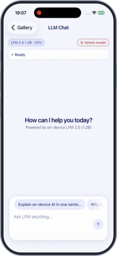
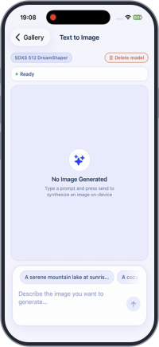
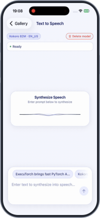
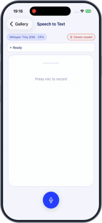
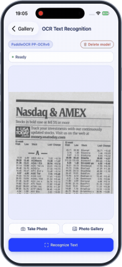
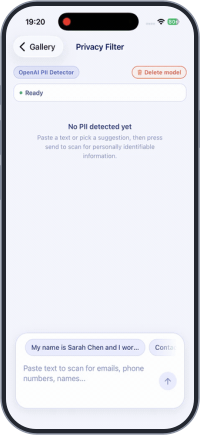

<div align="center">
  <picture>
    <source media="(prefers-color-scheme: dark)" srcset="https://github.com/software-mansion/react-native-executorch/raw/main/docs/static/img/logo-vertical-dark.svg">
    
  </picture>
  <br />
  <br />
  
</div>

<br />
<br />

**React Native ExecuTorch Gallery** is an interactive showcase app designed to demonstrate what is possible with on-device AI and experience firsthand how fast it can run on your own phone.

Built with [`react-native-executorch`](https://github.com/software-mansion/react-native-executorch), each screen is a real, standalone example of idiomatic library usage across computer vision, local LLMs, speech synthesis, and natural language processing that can be lifted straight into your own app.

<div align="center">

|                                  **LLM Chat**                                  |                              **Text to Image**                               |                                     **Real-Time Vision**                                     |                               **Text to Speech**                               |
| :----------------------------------------------------------------------------: | :--------------------------------------------------------------------------: | :------------------------------------------------------------------------------------------: | :----------------------------------------------------------------------------: |
|              |  |  |  |
|                               **Speech to Text**                               |                           **OCR Text Recognition**                           |                                   **Privacy Filter (PII)**                                   |                              **Gallery Overview**                              |
|  |          |                |      |

</div>

## Getting Started

```bash
npm install
npm run ios       # or npm run android
```

## Requirements

- **Expo SDK 57** and **React Native 0.86**
- **iOS 17.0+**
- **Android 13.0+**

> [!IMPORTANT]
> The app requires a development build (Expo Go is not supported). Models are
> downloaded on first use and then run fully offline.

## Documentation

The full library documentation, task guides, architecture deep dives, and API references live in the main [`react-native-executorch`](https://github.com/software-mansion/react-native-executorch) repository. Each task screen in this showcase maps directly to an extension guide in the docs:

**[docs.swmansion.com/react-native-executorch](https://docs.swmansion.com/react-native-executorch/)**

## Created by Software Mansion

Since 2012, [Software Mansion](https://swmansion.com) has been building mobile and web apps, contributing to open-source software, and dealing with all kinds of React Native challenges. We are Core React Native Contributors. We can help you build your next AI product – [Hire us](https://swmansion.com/contact?utm_source=react-native-executorch-gallery&utm_medium=readme).

[](https://swmansion.com)
